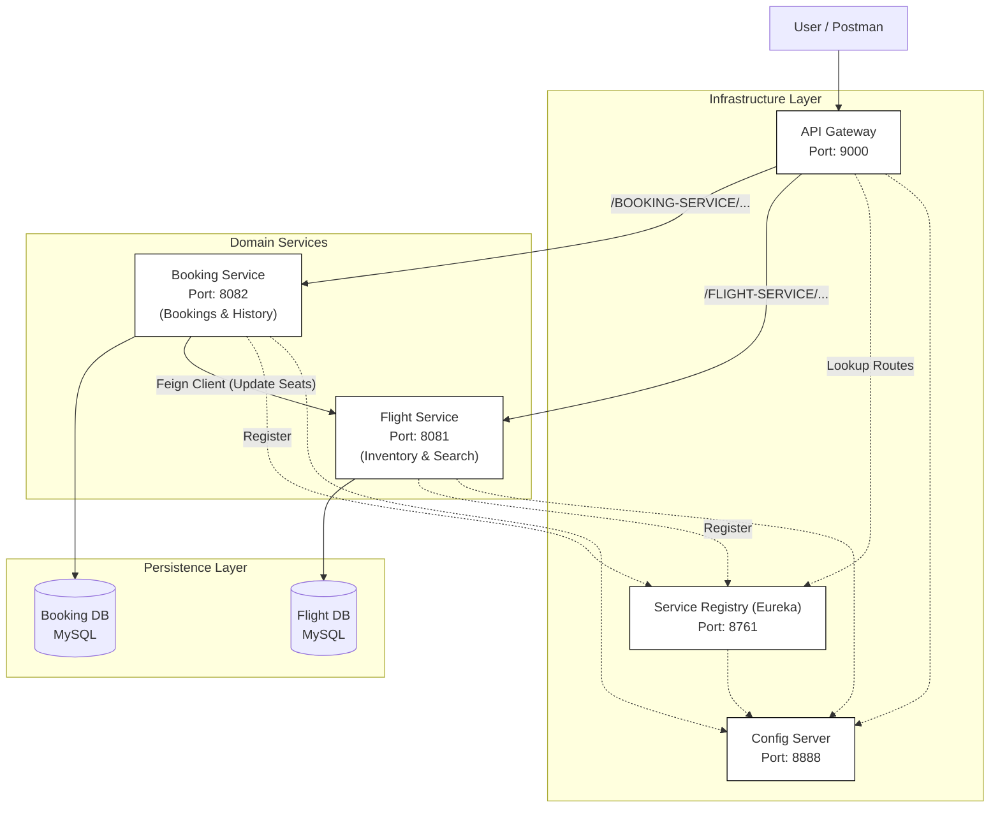

# Microservices Flight Booking System

> A complete transformation of a monolithic Flight Management System into a scalable, distributed microservices architecture using Spring Boot and Spring Cloud.

## 📖 Architecture Overview & Goals

### 1. Microservice Decomposition
The monolithic application was decomposed into independent, domain-driven services:
- **Flight Service (`8081`):** Handles flight inventory and search operations.
- **Booking Service (`8082`):** Manages booking transactions and passenger information.

### 2. Database per Service
Implemented the "Database per Service" pattern to ensure loose coupling:
- **`flight_service_db`:** Isolated MySQL database for inventory.
- **`booking_db`:** Isolated MySQL database for transactions.

### 3. Service Discovery
- **Netflix Eureka Server (`8761`):** Handles dynamic service registration, fault-tolerant lookup, and load-balanced routing.

### 4. API Gateway
- **Spring Cloud Gateway (`9000`):** Acts as the single entry point for the system.
- **Features:** Smart routing, pre/post-filtering, and a foundation for service-level authentication.

### 5. Inter-Service Communication
- **OpenFeign:** Internal service calls are handled via declarative Feign REST clients.
- **Workflow:** The *Booking Service* communicates with the *Flight Service* over HTTP to validate flights and update seat availability.

### 6. Centralized Configuration
- **Spring Cloud Config Server (`8888`):** Manages all service configurations externally via a centralized Git repository.

## 🏗️ Architecture Diagram



## 📂 Project Structure

```
Microservices-flight-app/
├── flightapp-api-gateway/      # Entry point and routing (Port 9000)
├── flightapp-booking-service/  # Booking business logic (Port 8082)
├── flightapp-config-server/    # Centralized configuration (Port 8888)
├── flightapp-flight-service/   # Inventory and search logic (Port 8081)
├── flightapp-service-registry/ # Eureka discovery server (Port 8761)
├── jmeter-reports/             # Performance dashboards
└── postman-reports/            # Newman execution logs
```
